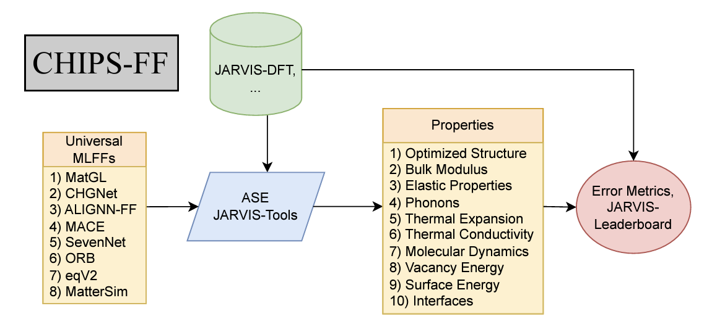

# CHIPS-FF

## Overview

The `chipsff` repository provides a comprehensive framework for performing materials simulations with machine learning force fields (MLFFs). Simulations include structural relaxation, vacancy and surface energy calculations, interface analysis, elastic properties, phonons and thermal properties. The code supports multiple universal MLFFs and integrates with the JARVIS database and the Atomic Simulation Environment (ASE) to facilitate various materials simulations and workflows.

## Features

- **Structural Relaxation**: Optimize atomic structures using various MLFF calculators and optimization algorithms.
- **Energy-Volume (E-V) Curve**: Fit the E-V curve using an equation of state (EOS) to obtain bulk modulus and equilibrium energy and volume.
- **Elastic Properties**: Calculate elastic tensors.
- **Vacancy and Surface Energy Calculations**: Compute vacancy formation energies and surface energies for different types of vacancies and surface terminations.
- **Phonon Analysis**: Generate phonon band structures, density of states (DOS), and thermal properties using Phonopy.
- **Thermal Conductivity**: Calculate thermal conductivity using third order force constants from Phono3py. 
- **Thermal Expansion**: Perform thermal expansion calculations using the Quasi-Harmonic Approximation (QHA).
- **Molecular Dynamics (MD) Simulations**: Conduct MD simulations to melt and quench structures, and calculate Radial Distribution Functions (RDFs).  
- **Support for Multiple Calculators**: Seamlessly switch between different MLFF calculators such as `alignn_ff`, `chgnet`, `sevenn`, `mace`, `matgl`, custom, etc.
- **Automatic Error Calculation**: Direct comparison to density functional theory (DFT) calculations from JARVIS-DFT.

## Installation

Clone the repository:
```bash
git clone https://github.com/usnistgov/chipsff
```
Set up a conda environment:
```bash
conda env create -f environment.yml -n chipsff
conda activate chipsff
```
Install the CHIPS-FF package:
```bash
cd chipsff
pip install -e .
```

## Examples

| Notebooks                                                                                                                                      | Google&nbsp;Colab                                                                                                                                        | Descriptions                                                                                                                                                                                                                                                                                                                                                                                              |
| ---------------------------------------------------------------------------------------------------------------------------------------------- | -------------------------------------------------------------------------------------------------------------------------------------------------------- | --------------------------------------------------------------------------------------------------------------------------------------------------------------------------------------------------------------------------------------------------------------------------------------------------------------------------------------------------------------------------------------------------------- |
| [Structure optimization](https://colab.research.google.com/github/knc6/jarvis-tools-notebooks/blob/master/jarvis-tools-notebooks/chipsff_optimization.ipynb)                                                       | [![Open in Google Colab]](https://colab.research.google.com/github/knc6/jarvis-tools-notebooks/blob/master/jarvis-tools-notebooks/chipsff_optimization.ipynb)                                 | Examples for comparing errors in lattice parameter predictions, bulk modulus, elastic constants, etc.                                                                                                                                                                                                                                                                       |
| [Scaling/timing comparison](https://colab.research.google.com/github/knc6/jarvis-tools-notebooks/blob/master/jarvis-tools-notebooks/chipsff_scaling.ipynb)                                                  | [![Open in Google Colab]](https://colab.research.google.com/github/knc6/jarvis-tools-notebooks/blob/master/jarvis-tools-notebooks/chipsff_scaling.ipynb)                            | Examples of analyzing scaling and timing comparisons.                                                                                                                                                                                                                                                                                                                                 |


                                                                                                                                                    

[Open in Google Colab]: https://colab.research.google.com/assets/colab-badge.svg


## Requirements

The following libraries and tools are required:

- `python >= 3.9`
- `numpy`
- `matplotlib`
- `pandas`
- `scikit-learn`
- `ase`
- `phonopy`
- `phono3py`
- `jarvis-tools`
- `intermat`
- `h5py`
- `plotly`
- `ruamel`
## Universal MLFFs Implemented

- `alignn_ff`
- `chgnet`
- `sevenn`
- `mace`
- `matgl`
- `orb`
- `fairchem`

**Note**: Some calculators may have additional dependencies or require specific versions of libraries. Please refer to their respective documentation for setup instructions. To install the `intermat` package, see [here](https://github.com/usnistgov/intermat).

## Input File Parameters

The input configuration file is a JSON file that specifies all required settings for performing materials simulations. Below is a detailed explanation of each parameter and its expected values.

### Primary Parameters

- **`jid`** *(string)*: The JARVIS ID of the material to analyze (e.g., `"JVASP-1002"`). This identifier is used to fetch structural data from the JARVIS database.

- **`jid_list`** *(list of strings)*: A list of multiple JARVIS IDs for batch analysis (e.g., `["JVASP-1002", "JVASP-816", "JVASP-867"]`). Only used if analyzing multiple materials.

- **`film_id`** and **`substrate_id`** *(list of strings)*: Lists of JARVIS IDs for film and substrate materials, respectively, in an interface analysis (e.g., `["JVASP-1002"]` and `["JVASP-816"]`).
- **`calculator_type`** *(string)*: Specifies the MLFF calculator to use for analysis. Each calculator corresponds to a different machine learning force field or calculation model.

- **`calculator_types`** *(list of strings)*: A list of calculators to use for batch processing (e.g., `["alignn_ff", "chgnet"]`). Only required if analyzing multiple calculators for batch processing.

- **`chemical_potentials_file`** *(string)*: Path to the JSON file containing chemical potentials for elements (e.g., `"chemical_potentials.json"`). Required for formation energy and defect calculations. If an entry is missing for a particular element or MLFF calculator, it will be automatically calculated and stored in the chemical_potentials.json file.

### Structural and Interface Settings

- **`film_index`** and **`substrate_index`** *(string)*: Miller indices for the film and substrate in interface analysis, respectively. Example: `"1_1_0"` for both film and substrate.

- **`use_conventional_cell`** *(boolean)*: Determines whether to use a conventional cell for the simulation. Set to `true` to use the conventional cell structure, or `false` for the primitive cell.

### Properties to Calculate

- **`properties_to_calculate`** *(list of strings)*: Specifies which properties to calculate during the workflow. Each string represents a calculation or analysis task. Options include:
  - `"relax_structure"`: Perform initial structural relaxation.
  - `"calculate_formation_energy"`: Calculate formation energy per atom.
  - `"calculate_ev_curve"`: Fit the energy-volume (E-V) curve.
  - `"calculate_elastic_tensor"`: Compute the elastic tensor.
  - `"run_phonon_analysis"`: Run phonon band structure and thermal property calculations.
  - `"analyze_defects"`: Calculate vacancy formation energies.
  - `"analyze_surfaces"`: Calculate surface energies.
  - `"analyze_interfaces"`: Perform interface analysis.
  - `"run_phonon3_analysis"`: Run calculations for thermal conductivity.
  - `"calculate_thermal_expansion"`: Calculate the thermal expansion coefficient.
  - `"general_melter"`: Perform MD melting and quenching simulations.
  - `"calculate_rdf"`: Calculate the Radial Distribution Function (RDF) for a quenched structure.

### Relaxation and Analysis Settings

#### Bulk Relaxation Settings

- **`bulk_relaxation_settings`** *(dictionary)*: Configures the relaxation process for bulk structures. Contains:
  - **`filter_type`** *(string)*: Specifies the filter type in ASE. Options include `"ExpCellFilter"` (exponential cell filter) and other filters.
  - **`relaxation_settings`** *(dictionary)*: Contains relaxation parameters:
    - **`constant_volume`** *(boolean)*: If `true`, keeps the volume constant during relaxation.
    - **`fmax`** *(float)*: Convergence criterion for force (e.g., `0.05`).
    - **`steps`** *(int)*: Maximum number of optimization steps (e.g., `200`).

#### Phonon Settings

- **`phonon_settings`** *(dictionary)*: Configures phonon calculation parameters. Contains:
  - **`dim`** *(list of integers)*: Specifies the supercell dimensions for phonon calculations (e.g., `[2, 2, 2]`).
  - **`distance`** *(float)*: Specifies the displacement distance for finite-displacement phonon calculations (e.g., `0.2`).

#### Defect Settings

- **`defect_settings`** *(dictionary)*: Configures defect analysis, including vacancy formation energy calculations. Contains:
  - **`generate_settings`** *(dictionary)*: Contains parameters for defect generation:
    - **`on_conventional_cell`** *(boolean)*: If `true`, generates defects on a conventional cell.
    - **`enforce_c_size`** *(int)*: Minimum size constraint for the c-axis (e.g., `8`).
    - **`extend`** *(int)*: Extends the unit cell to create a supercell (e.g., `1`).
  - **`filter_type`** *(string)*: Specifies the filter type used during relaxation.
  - **`relaxation_settings`** *(dictionary)*: Contains settings similar to `bulk_relaxation_settings` (e.g., `constant_volume`, `fmax`, `steps`).

#### Surface Settings

- **`surface_settings`** *(dictionary)*: Configures surface energy calculations. Contains:
  - **`indices_list`** *(list of lists of integers)*: Specifies Miller indices for surface orientations (e.g., `[[1, 0, 0], [1, 1, 1]]`).
  - **`layers`** *(int)*: Number of atomic layers in the surface (e.g., `4`).
  - **`vacuum`** *(float)*: Vacuum thickness in Ångströms (e.g., `18`).
  - **`filter_type`** *(string)*: Specifies the filter type used during relaxation.
  - **`relaxation_settings`** *(dictionary)*: Similar to `bulk_relaxation_settings`.

#### Phonon3 Settings

- **`phonon3_settings`** *(dictionary)*: Configures third order force constant calculations for thermal conductivity. Contains:
  - **`dim`** *(list of integers)*: Supercell dimensions (e.g., `[2, 2, 2]`).
  - **`distance`** *(float)*: Displacement distance (e.g., `0.2`).

#### MD Settings

- **`md_settings`** *(dictionary)*: Configures parameters for MD simulations, specifically for melting and quenching. Contains:
  - **`dt`** *(float)*: Time step in femtoseconds (e.g., `1`).
  - **`temp0`** *(float)*: Initial temperature for melting (e.g., `3500` K).
  - **`nsteps0`** *(int)*: Number of steps for melting phase (e.g., `1000`).
  - **`temp1`** *(float)*: Final temperature for quenching (e.g., `300` K).
  - **`nsteps1`** *(int)*: Number of steps for quenching phase (e.g., `2000`).
  - **`taut`** *(float)*: Temperature coupling parameter (e.g., `20`).
  - **`min_size`** *(float)*: Minimum cell size in Ångströms (e.g., `10.0`).

## Usage
The main script `run_chipsff.py` provides a command-line interface to perform various materials analyses.

**1. Single Material Analysis**
To run an analysis on a single material by providing an input.json file:
```bash
python run_chipsff.py --input_file input.json
```
An example `input.json` file: 
```bash
{
  "jid": "JVASP-1002",
  "calculator_type": "chgnet",
  "chemical_potentials_file": "chemical_potentials.json",
  "properties_to_calculate": [
    "relax_structure",
    "calculate_ev_curve",
    "calculate_formation_energy",
    "calculate_elastic_tensor",
    "run_phonon_analysis",
    "analyze_surfaces",
    "analyze_defects",
    "run_phonon3_analysis",
    "general_melter",
    "calculate_rdf"
  ],
"bulk_relaxation_settings": {
  "filter_type": "ExpCellFilter",
  "relaxation_settings": {
    "fmax": 0.05,
    "steps": 200,
    "constant_volume": false
  }
},
  "phonon_settings": {
    "dim": [2, 2, 2],
    "distance": 0.2
  },
  "use_conventional_cell": true,
  "surface_settings": {
    "indices_list": [
      [0, 1, 0],
      [0,0,1]
    ],
    "layers": 4,
    "vacuum": 18,
    "relaxation_settings": {
      "fmax": 0.05,
      "steps": 200,
      "constant_volume": true
    },
    "filter_type": "ExpCellFilter"
  },
  "defect_settings": {
    "generate_settings": {
      "on_conventional_cell": true,
      "enforce_c_size": 8,
      "extend": 1
    },
    "relaxation_settings": {
      "fmax": 0.05,
      "steps": 200,
      "constant_volume": true
    },
    "filter_type": "ExpCellFilter"
  },
  "phonon3_settings": {
    "dim": [2, 2, 2],
    "distance": 0.2
  },
  "md_settings": {
    "dt": 1,
    "temp0": 35,
    "nsteps0": 10,
    "temp1": 200,
    "nsteps1": 20,
    "taut": 20,
    "min_size": 10.0
  }
}
```
**2. Interface Analysis**
To perform an interface analysis between a film and substrate:
```bash
python run_chipsff.py --input_file interface_input.json
```
An example `interface_input.json` file:
```bash
{
  "film_id": ["JVASP-1002"],
  "substrate_id": ["JVASP-816"],
  "calculator_type": "alignn_ff",
  "chemical_potentials_file": "chemical_potentials.json",
  "film_index": "1_1_0",
  "substrate_index": "1_1_0",
  "properties_to_calculate": [
    "analyze_interfaces"
  ]
}
```
## Key Methods

- `relax_structure()`: Optimizes the atomic structure using the specified calculator and relaxation settings.
- `calculate_formation_energy(relaxed_atoms)`: Computes the formation energy per atom based on the relaxed structure and chemical potentials.
- `calculate_elastic_tensor(relaxed_atoms)`: Calculates the elastic tensor for the relaxed structure.
- `calculate_ev_curve(relaxed_atoms)`: Fits the energy-volume curve using an equation of state to obtain bulk modulus, minimum energy and equilibrium volume.
- `run_phonon_analysis(relaxed_atoms)`: Performs phonon band structure calculations, density of states, and thermal properties using Phonopy.
- `analyze_defects()`: Analyzes vacancy formation energies by generating defects, relaxing them, and calculating formation energies.
- `analyze_surfaces()`: Analyzes surface energies by generating surface structures, relaxing them, and calculating surface energies.
- `run_phonon3_analysis(relaxed_atoms)`: Runs third order force constant calculations for thermal conductivity using Phono3py.
- `calculate_thermal_expansion(relaxed_atoms)`: Calculates the thermal expansion coefficient using the Quasi-Harmonic Approximation.
- `general_melter(relaxed_atoms)`: Performs MD simulations to melt and quench the structure, then calculates the Radial Distribution Function (RDF). Can be used to generate amorphous structures. 
- `analyze_interfaces()`: Performs interface analysis between film and substrate materials using the `intermat` package.

## How to contribute
For detailed instructions, please see [Contribution instructions](https://github.com/usnistgov/jarvis/blob/master/Contribution.rst)

## Correspondence
Please report bugs as Github issues (https://github.com/usnistgov/chipsff/issues) or email to daniel.wines@nist.gov or kamal.choudhary@nist.gov.

## Funding support
This work was performed with funding from the CHIPS Metrology Program, part of CHIPS for America, National Institute of Standards and Technology, U.S. Department of Commerce.


## Code of conduct
Please see [Code of conduct](https://github.com/usnistgov/jarvis/blob/master/CODE_OF_CONDUCT.md)
